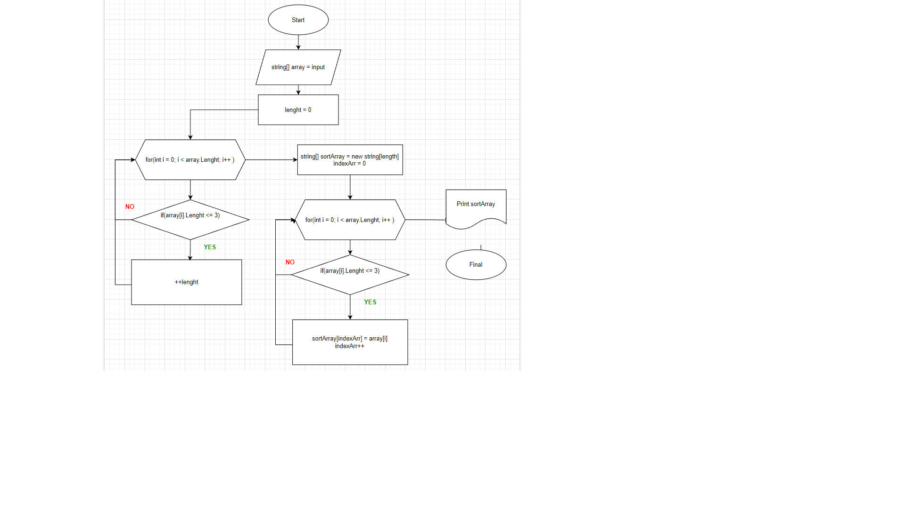

# Итоговая контрольная работа по основному блоку

1. Создать репозиторий на GitHub
   https://github.com/Eleutherius1517/FinalControlWork.git
2. Нарисовать блок-схему алгоритма (можно обойтись блок-схемой основной содержательной части, если вы выделяете её в отдельный метод)
   
3. Снабдить репозиторий оформленным текстовым описанием решения (файл README.md)
    ## Задача: 
    Написать программу, которая из имеющегося массива строк формирует новый массив из строк, длина которых меньше, либо равна 3 символам. Первоначальный массив можно ввести с клавиатуры, либо задать на старте выполнения алгоритма. При решении не рекомендуется пользоваться коллекциями, лучше обойтись исключительно массивами.
    **Решение:**
    1. Напишем метод получения исходного массива строк.
    2. Напишем метод который вернет длинну нового массива.
    3. Создадим новый массив, определенной ранее длинны.
    4. Выведем массив на терминал вывода(консоль).

4. Написать программу, решающую поставленную задачу
5. Использовать контроль версий в работе над этим небольшим проектом (не должно быть так, что всё залито одним коммитом, как минимум   этапы 2, 3, и 4 должны быть расположены в разных коммитах)

